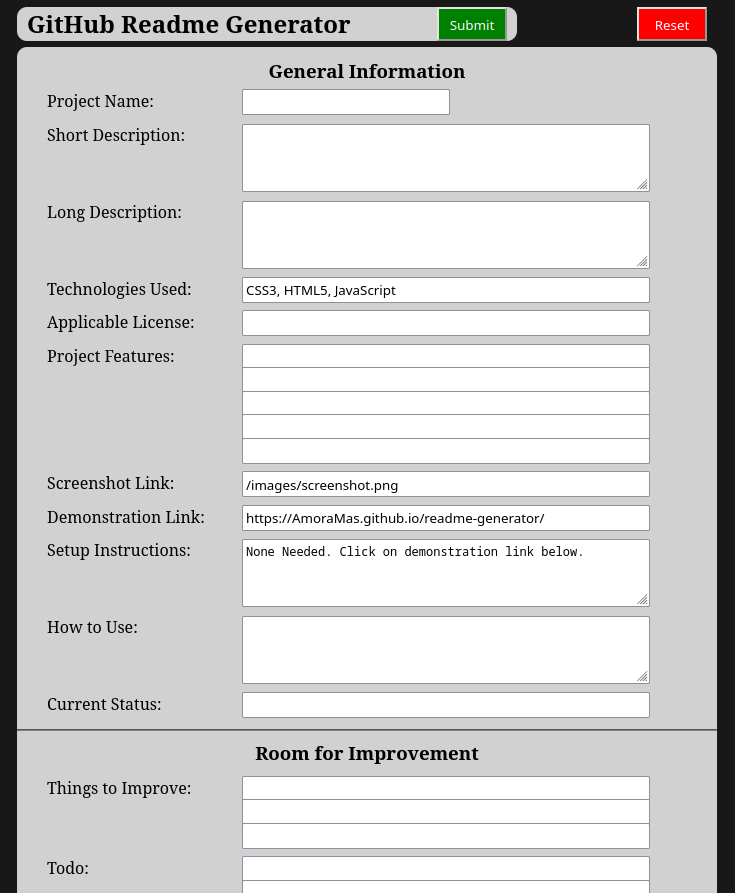

# GitHub Readme Generator

> Web form that generates a Readme for your project after asking questions about it.

## Table of Contents

- [General Information](#general-information)
  - [Technologies Used](#technologies-used)
  - [Features](#features)
  - [Screenshots](#screenshots)
  - [Setup](#setup)
  - [Usage](#usage)
  - [Current Status](#current-status)
- [Room For Improvement](#room-for-improvement)
- [Acknowledgements](#acknowledgements)
- [Contact](#contact)
- [License](#license)

## General Information

>

## Technologies Used

> CSS3, HTML5, Javascript, jQuery 3.6.1

## Features

- Web form saves data across uses, but can be easily reset to defautl values.
- Can save your default entries in the .js file under the defaultValues object.
- Helps provide a consistent readme appearance across all your projects.

## Screenshot(s)

> 

## Setup

- None needed. Click on demonstration link below.
- Or to run locally, copy all three index.xxxx files into a directory and point your browser to the index.html page.

[Project Demonstration](https://AmoraMas.github.io/RepoName/)

## Usage

- Fill in all the form fields with correct information.
- Click the Submit button.
- Copy/Paste the results into your projects README.md file.
- Make adjustments as needed.

## Current Status

> Working, but needs improvement.

## Room For Improvement

- Ideas:
  - Adjust ToC and output to not include empty form fields.
  - Adjust scroll so that it doesn't cover up title/button section.
  - Adjust some fields to be combo/dropdown boxes for selectable items.
- Todo:
  - Save info to README.md file.
  - Add license section.
  - Add tests to ensure required fields are present.

## Acknowledgements

- Inspired By:
  - https://github.com/kevin-foreman/README-Generator
- Based On:
  - https://bulldogjob.com/readme/how-to-write-a-good-readme-for-your-github-project
- Contributors:
  - N/A

## Contact

> [amoramas1984@gmail.com](mailto:amoramas1984@gmail.com)

## License

>
